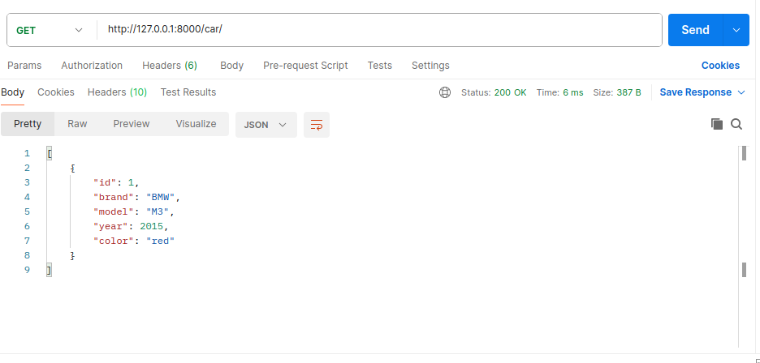
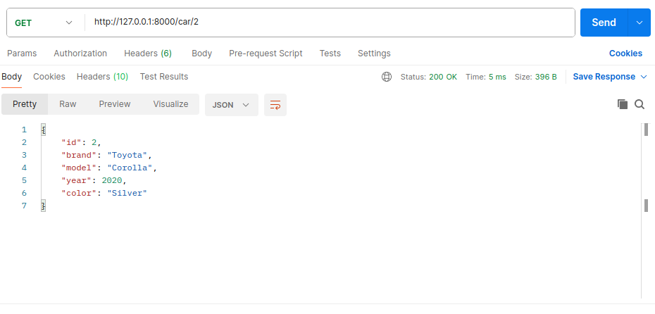
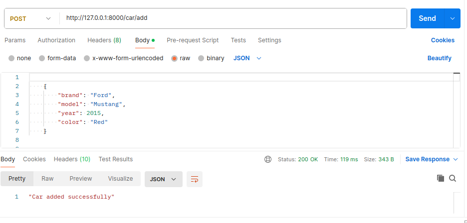
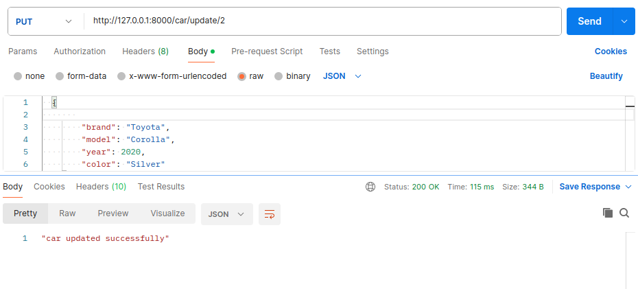
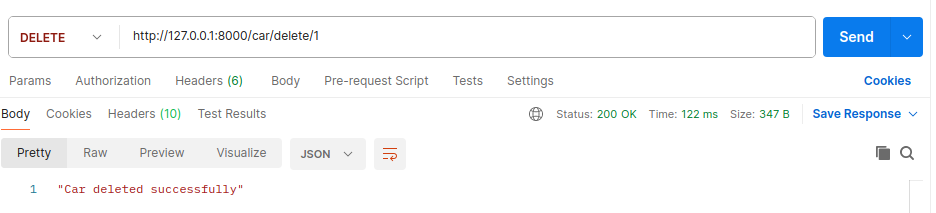
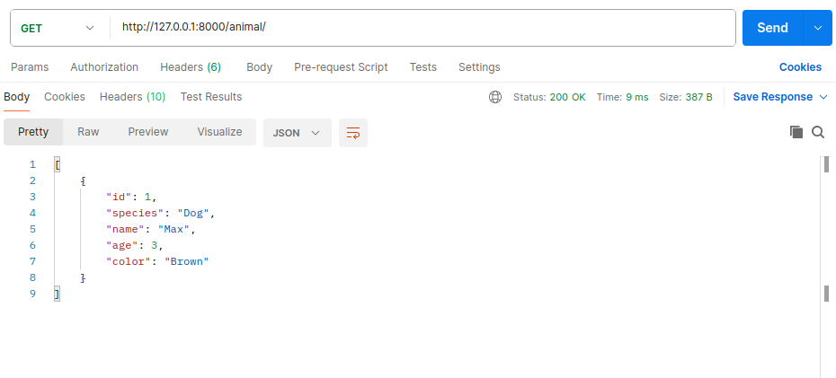
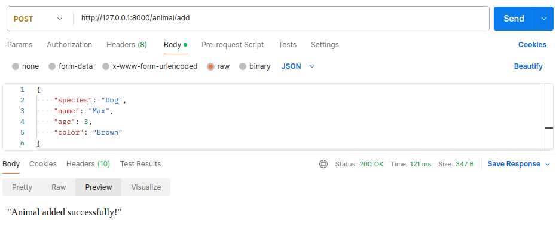
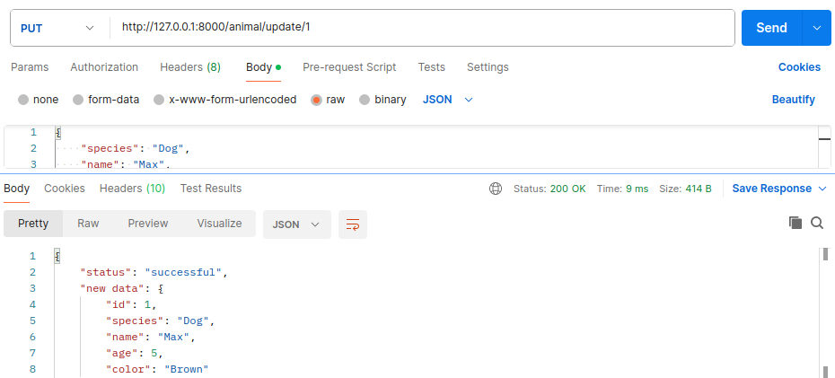
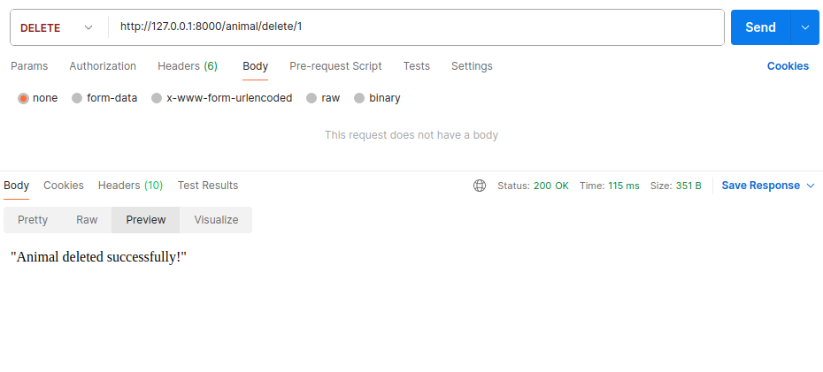

# Django Project: Car and Animal API

This Django project provides REST APIs for managing cars and animals.

## Car API

### GET - Retrieve All Cars

## /car/

### GET - Retrieve Specific Car

## /car/\<id>

### POST - Add a Car

## /car/add

### UPDATE - Update a Car

## /car/update/<id>

### DELETE - Delete a Car

## /car/delete/\<id>

## Animal API

### GET - Retrieve All Animals

## /animal/

### POST - Add an Animal

## /animal/add

### UPDATE - Update an Animal

## /animal/update/\<id>

### DELETE - Delete an Animal

## /animal/delete/\<id>

